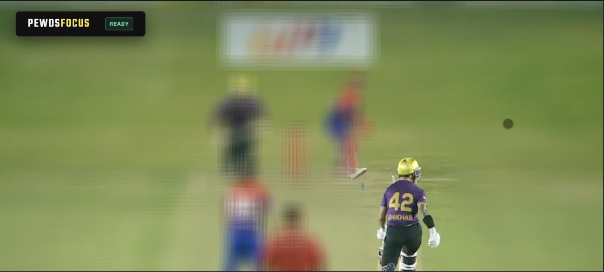

# PEWDS FOCUS

A real-time smart auto-focus and subject tracking app that runs entirely in your browser. No servers, no uploads — ML inference, subject tracking, and cinematic bokeh blur all happen locally on your machine.



## Features

- **Zero-server architecture** — 100% of ML inference runs client-side via WebAssembly
- **Smart subject tracking** — a cost-function tracker maintains a lock on your selected subject and prevents "focus hop" when objects cross paths
- **WebGPU bokeh blur** — real-time depth-of-field rendering at 60fps
- **Dual input** — works with a live webcam or a pre-recorded video file
- **Non-blocking UI** — ML processing runs inside dedicated Web Workers so the interface stays smooth


## Setup

PEWDS FOCUS uses ES modules and Web Workers, so it needs to be served over HTTP rather than opened directly as a file. Pick whichever option suits you.

**Node.js**
```bash
npx serve .
```
Then open the URL printed in your terminal (usually `http://localhost:3000`).

**Python**
```bash
python -m http.server 8000
```
Then open `http://localhost:8000`.

A browser with WebGPU support is required — Chrome or Edge 113+ is recommended.

## How it works

### Machine learning

Object detection uses Google MediaPipe's EfficientDet-Lite0 (TFLite), running via WASM inside a Web Worker. EfficientDet's weighted BiFPN and compound scaling give it near state-of-the-art accuracy at a fraction of the cost of heavier models, which is what makes it practical for in-browser, edge execution.

### Tracking

Raw object detection has a well-known problem: if two subjects cross paths, the detector will often swap their IDs. PEWDS FOCUS avoids this with a custom predictive cost function that runs on every frame.

- **Momentum / coast tracking** — a constant-velocity model predicts where the subject should be next. If the subject disappears (occlusion, motion blur), the tracker coasts the bounding box along its predicted path for up to 15 frames, applying a 0.95x friction multiplier each frame.
- **Normalized distance** — Euclidean distance between the predicted position and each new detection is normalized by screen width, so fast-moving subjects don't generate disproportionately large penalties.
- **Color histogram matching** — the tracker builds an HSV color histogram of the target using an Epanechnikov kernel, which weights central pixels more heavily and ignores noisy edges. This "color fingerprint" is compared against candidate boxes using Bhattacharyya distance.
- **Dynamic search radius** — when color similarity exceeds 85%, the search radius expands to 80% of the screen width, allowing the tracker to follow fast, erratic movement without losing the lock.

### Rendering

The visual layer runs independently of the ML loop via WebGPU and WGSL shaders. Video frames are streamed from an offscreen canvas to the GPU as `rgba8unorm` textures. A fragment shader applies a box blur to the background and generates a soft alpha mask around the tracked bounding box using `smoothstep`, then blends the sharp and blurred textures together to simulate camera depth-of-field.
